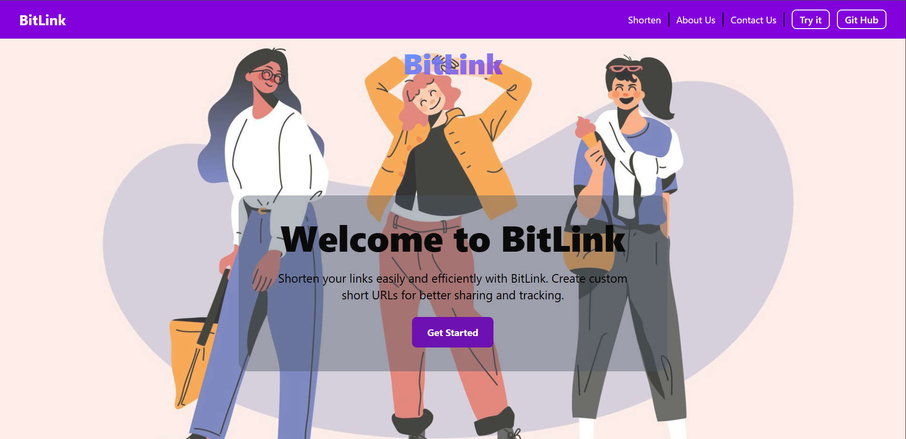

# 🔗 Bit Link


Bit Link is a modern and fast URL shortener web application built using Next.js.  
It allows users to convert long URLs into short and shareable links with a clean and responsive interface.

## 💡 Why Bit Link?

Bit Link was built to provide a simple, fast, and customizable URL shortening experience using modern web technologies.

## 📸 Preview


---

## 🌐 Live Demo

👉 https://bit-link.netlify.app

---

## ✨ Features

- 🔗 Shorten long URLs instantly
- ✍️ Create custom short links
- ⚡ Fast and responsive UI
- 📱 Mobile-friendly design
- 🎨 Clean and modern interface
- 🚀 Hosted on Netlify

---

## 🛠️ Tech Stack

- **Next.js** 16.2
- **React.js** 19.1
- **JavaScript** (ES6+)
- **MongoDB** (for data storage)
- **Tailwind CSS** (for styling)
- **React Toastify** (for notifications)

---

## 📦 Installation

Clone the repository:

```bash
git clone https://github.com/Vimal-79/BitLink.git
```

Move into the project directory:

```bash
cd BitLink
```

Install dependencies:

```bash
npm install
```
---

## 🔧 Environment Variables

Create a `.env.local` file in the root directory and add:

```bash
MONGODB_URI=your_mongodb_connection_string
```

Replace `your_mongodb_connection_string` with your MongoDB connection URI.
---

## ▶️ Running Locally

Start the development server:

```bash
npm run dev
```

Open your browser and visit:

```bash
http://localhost:3000
```

---

## 🚀 Production Build

Build the application:

```bash
npm run build
```

Start the production server:

```bash
npm start
```

---

## 📁 Project Structure

```bash
app/
├── page.js                 # Home page
├── layout.js              # Root layout
├── globals.css            # Global styles
├── about/
│   └── page.js           # About page
├── contact/
│   └── page.js           # Contact page
├── shorten/
│   └── page.js           # Shorten URL page
├── [shorturl]/
│   └── page.js           # Dynamic redirect page
└── api/
    ├── generate/
    │   └── route.js      # API to generate short URLs
    └── feedback/
        └── route.js      # API to submit feedback
components/
├── Navbar.js             # Navigation bar
└── Skeleton.js           # Loading skeleton component
lib/
└── mongo.js              # MongoDB connection
public/                    # Static assets
```

---

## 🔌 API Endpoints

### Generate Short URL
- **Endpoint:** `POST /api/generate`
- **Body:** `{ "url": "long_url", "shortURL": "custom_short_url" }`
- **Response:** Returns shortened URL with success status
- **Features:** Validates duplicate short URLs, stores in MongoDB

### Submit Feedback
- **Endpoint:** `POST /api/feedback`
- **Body:** `{ "name": "user_name", "email": "user_email", "message": "feedback_text" }`
- **Response:** Confirmation of feedback submission
- **Features:** Stores feedback with timestamp in MongoDB

### Redirect Short URL
- **Endpoint:** `GET /[shorturl]`
- **Function:** Redirects short URL to original long URL
- **Dynamic:** Uses URL parameters to fetch and redirect

---

## 🌍 Deployment

This project is deployed on Netlify:

👉 https://bit-link.netlify.app

---

## 🤝 Contributing

Contributions are welcome.

Fork the repository and submit a pull request to improve the project.

---

## 📄 License

This project is licensed under the MIT License.

---

## 👨‍💻 Author

Made with ❤️ by [Vimal](https://github.com/Vimal-79)